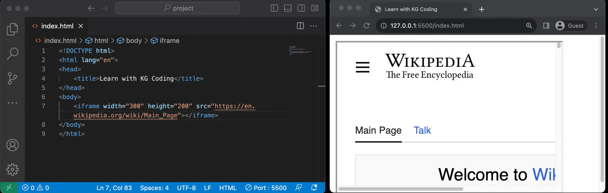

# **`<iframe>` Tag in HTML**  

The `<iframe>` (inline frame) tag is used to embed **another webpage or content** inside the current HTML document. It is commonly used for embedding **videos, maps, external websites, or other web applications**.



---

## **1. Purpose of `<iframe>`**

- Embeds **external web pages** into the current document.
- Displays **videos (e.g., YouTube, Vimeo)**.
- Integrates **Google Maps, ads, or widgets**.
- Used for **sandboxed content** (isolated from the main page).

---

## **2. Location of `<iframe>`**

- Can be placed **anywhere inside `<body>`**.
- Used inside **articles, sections, or sidebars**.

---

## **3. Single or Multiple Instances?**

| **Use Case** | **Allowed?** |
|-------------|------------|
| Multiple `<iframe>` elements per page | ✅ Allowed |
| Nesting `<iframe>` inside another `<iframe>` | ✅ Allowed (but not recommended) |
| Embedding untrusted third-party sites | ❌ Security risk! |

🚨 **Note:** Avoid excessive `<iframe>` usage as it can **slow down** the webpage.

---

## **4. Example – Embedding a Web Page**

```html
<iframe src="https://www.example.com" width="600" height="400"></iframe>
```

### **Explanation of sandbox attribute:**

- `src="https://www.example.com"` → Specifies the embedded webpage.
- `width="600"` & `height="400"` → Defines the **size** of the iframe.

---

## **5. Example – Embedding a YouTube Video**

```html
<iframe width="560" height="315" 
    src="https://www.youtube.com/embed/dQw4w9WgXcQ" 
    title="YouTube video player"
    frameborder="0"
    allow="accelerometer; autoplay; clipboard-write; encrypted-media; gyroscope; picture-in-picture"
    allowfullscreen>
</iframe>
```

### **Explanation:**

- `src="https://www.youtube.com/embed/... "` → YouTube **embed link**.
- `allowfullscreen` → Enables **full-screen mode**.
- `allow="..."` → Enables additional features (e.g., autoplay, clipboard access).

---

## **6. Important Attributes of `<iframe>`**

| **Attribute** | **Description** |
|--------------|----------------|
| `src` | Specifies the URL of the embedded content. |
| `width` | Defines the width of the iframe. |
| `height` | Defines the height of the iframe. |
| `title` | Improves accessibility for screen readers. |
| `frameborder="0"` | Removes the border around the iframe. |
| `allowfullscreen` | Allows full-screen mode (useful for videos). |
| `sandbox` | Restricts iframe actions for security. |

---

## **7. Example – Restricting Content with `sandbox`**

```html
<iframe src="https://www.example.com" width="600" height="400" sandbox></iframe>
```

### **Explanation**

- `sandbox` → Restricts scripts and form submissions inside the iframe.
- Enhances **security** when embedding third-party content.

---

## **8. Best Practices**

✅ Use `<iframe>` for **trusted content only**.  
✅ Add `title` for **accessibility** and better SEO.  
✅ Restrict untrusted `<iframe>` sources using `sandbox`.  
✅ Avoid using too many `<iframe>` elements (affects **page speed**).  
